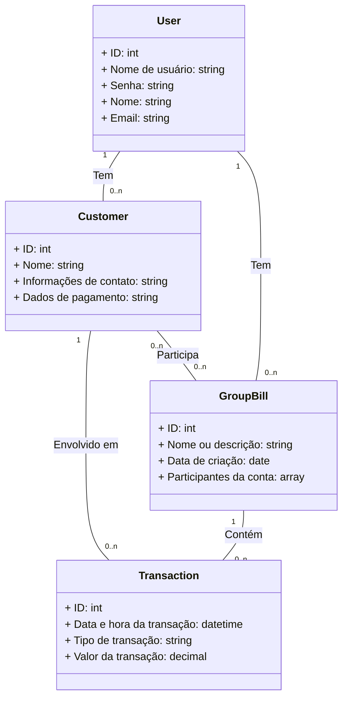

# Aplicação de Gerenciamento de Pagamentos de Pessoas (Vulgo JamesApp)

Esta é uma aplicação com o objetivos de gerenciar pagamentos de pessoas para grupos (boloões por exemplo), 
onde um usuário recebe transferencias de cada pessoa, e esta pessoa pode participar de vários grupos.

## Tecnologias Utilizadas

- Linguagem: Java 17
- Framework: Spring Boot 3.1.4
- Banco de Dados: MySQL
- Bibliotecas Adicionais:

## Principais Funcionalidades

- Registro de clientes (pessoas).
- Criação e gerenciamento de grupos.
- Criação de faturas (bills) por um usuário.
- Registro de transações, incluindo pagamentos e reembolsos.
- Atualização automática do saldo dos clientes com base nas transações.

## Principais Rotas

- **GET /api/me:** Retorna o usuário atual
- **GET /api/users:** Retorna a lista de todos os usuários
- **GET /api/users/{id}:**
- **GET /api/customers:** Retorna a lista de todos os clientes.
- **GET /api/groups:** Retorna a lista de todos os grupos.
- **POST /api/groups:** Cria um novo grupo.
- **GET /api/bills:** Retorna a lista de todas as faturas.
- **POST /api/bills:** Cria uma nova fatura.
- **GET /api/transactions:** Retorna a lista de todas as transações.
- **POST /api/transactions:** Registra uma nova transação.

## Documentação das Rotas

A documentação detalhada das rotas e seus parâmetros pode ser encontrada [aqui](URL_DA_DOCUMENTAÇÃO).

## Configuração do Banco de Dados

Esta aplicação usa um banco de dados [inserir nome do banco de dados] para armazenar informações de clientes, grupos, faturas e transações. Certifique-se de configurar as propriedades de conexão do banco de dados no arquivo `application.properties` ou `application.yml`.

```properties
spring.datasource.url=jdbc:mysql://localhost:3306/nome_do_banco
spring.datasource.username=seu_usuario
spring.datasource.password=sua_senha
```

## Como Executar
1. Clone o repositório para sua máquina.
2. Configure as propriedades do banco de dados no arquivo application.properties.
3. Execute a aplicação com o comando ./mvnw spring-boot:run (Maven Wrapper) 
ou mvn spring-boot:run (se você tiver o Maven instalado).
4. Acesse a API em http://localhost:8080.


### Diagrama de entidades


# Licença
Este projeto é licenciado sob a Licença MIT.